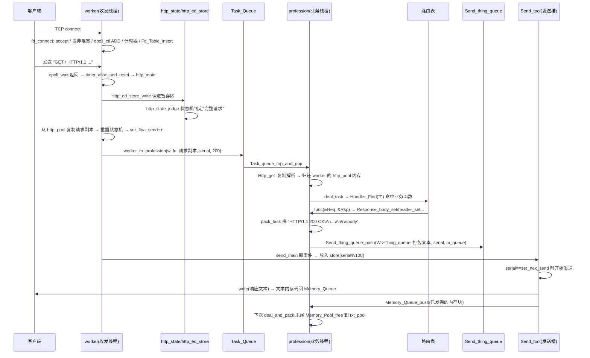

# c_web —— C 语言 HTTP 服务器项目结构与工作流程详解

> 本文档是**对项目源代码的整理与分析**，仅新建本文件，未修改项目内任何源代码。
> 参考仓库：https://github.com/yaoxianglongdegube-cloud/c_web
>
> 生成时间：2026-08-27　|　源码总量：约 4122 行（55 个 .c/.h 文件）

---

## 目录

1. [项目概览](#1-项目概览)
2. [目录结构总览](#2-目录结构总览)
3. [全局类型与头文件体系](#3-全局类型与头文件体系)
4. [各组件详解](#4-各组件详解)
   - 4.1 main —— 程序入口 / 驱动
   - 4.2 server —— 全局资源（路由表 + 任务队列）
   - 4.3 my_thread —— 收发线程(worker) 与业务线程(profession)
   - 4.4 connect_fd —— 连接 fd 表
   - 4.5 connect_config —— 连接管理（accept / close）
   - 4.6 http_analysis —— HTTP 接收、暂存与解析
   - 4.7 send_tool —— 有序发送工具
   - 4.8 queue —— 三个线程间队列
   - 4.9 memory_pool —— 内存池
   - 4.10 timer —— 断连计时器
   - 4.11 data_struct —— 基础数据结构（3 个哈希表 + 小顶堆）
   - 4.12 router —— 路由表
   - 4.13 request_response —— 请求 / 响应对象
   - 4.14 my_lock —— 读写锁
5. [工作流程](#5-工作流程)
6. [内存流向与所有权](#6-内存流向与所有权)
7. [线程同步方式汇总](#7-线程同步方式汇总)
8. [观察记录（仅备注，不修改代码）](#8-观察记录仅备注不修改代码)

---

## 1. 项目概览

这是一个**用纯 C 从零实现的并发 HTTP 服务器**，采用类似 nginx 的**半同步 / 半异步（HSPA）**线程模型：

- **收发线程（worker）**：每个 worker 拥有独立的 `epoll`、连接表、内存池、定时器、发送队列，负责
  监听 socket、accept 新连接、读取请求数据、状态机切分完整请求、把解析/业务任务下发给业务线程、以及把
  业务线程打包好的响应**按请求顺序**发回客户端。
- **业务处理线程（profession）**：从全局 `Task_Queue` 取出 HTTP 原文，完成 HTTP 头部解析、调用路由
  处理函数、构造响应（含文件响应），把打包好的响应塞回对应 worker 的 `Send_thing_queue`。

生产者-消费者关系：

```
 worker（收发线程，生产者/消费者）  ──push──▶  Task_Queue（全局任务队列）  ◀──pop──  profession（业务线程）
 profession（生产者）                ──push──▶  Send_thing_queue（每个 worker 一个发送事件队列） ◀──pop──  worker
 worker（发送完后的内存回收者）       ──push──▶  Memory_Queue（每个 profession 一个内存回收队列） ◀──pop──  profession
```

设计要点（从代码注释与实现中总结）：

- **每个连接按请求保序**：每个请求从读入起就打上递增序号 `serial`；发送侧用环形缓冲
  `Send_tool`（槽位 = `serial % blocknum`）保证「先收到的请求先发出」，即使后续请求先被业务线程处理完，
  也必须等待序号小的先发。
- **内存池 + 所有权显式化**：worker 侧 `http_pool`（存原始请求副本）、`store_area`（存暂存区与发送槽），
  profession 侧 `txt_pool`（存响应体/响应头/打包文本）、`http_pool`（存解析结构）。内存跨线程转移后，
  通过 `Memory_Queue` 把「使用完的块」送回所属线程统一释放。
- **HTTP 解析用状态机 + 分块暂存**：`http_state` 负责判断暂存区里是否已有完整请求；`http_ed_store`
  是「粘包/拆包」问题的解法——一次 read 可能读到多个请求或半个请求，暂存区负责缓冲与整理。
- **流程控制**：每个连接在途（未发完）的请求数 `pack_in_path` 受 `ed_store_blocknum`（100）限制，
  防止业务处理快于网络发送导致内存堆积。

---

## 2. 目录结构总览

| 目录 / 文件 | 职责 | 关键结构体（定义处） | 关键函数 |
|---|---|---|---|
| `main.c` / `main.h` | 程序入口 `Web_Driver()` | `main_t`, `main_t2` | `Web_Driver`, `func1`, `func2` |
| `server/global_resource.{c,h}` | 全局资源初始化 | — | `global_resource_init` |
| `my_thread/worker_thread.{c,h}` | 收发线程 | `worker` | `worker_init`, `receive_and_send_main`, `worker_to_profession` |
| `my_thread/profession_thread.{c,h}` | 业务处理线程 | `profession` | `profession_init`, `deal_and_pack`, `deal_task`, `pack_task` |
| `connect_fd/connect_fd.{c,h}` | 连接 fd 表（封装 hash_3） | `Fd_Entry`, `Fd_Table` | `Fd_Table_init/insert/delete/find` |
| `connect_config/connect_manage.{c,h}` | accept / close 连接 | — | `fd_connect`, `fd_close` |
| `http_analysis/http_main.{c,h}` | 每次读事件的处理入口 | — | `http_main` |
| `http_analysis/http_ed_store.{c,h}` | HTTP 暂存区（拆包粘包） | `http_ed_store` | `Http_ed_store_alloc/write/copy/expend/free/destroy` |
| `http_analysis/http_state.{c,h}` | 请求完整度状态机 | `http_state` | `http_state_judge`, `http_state_reset` |
| `http_analysis/http_analysis.{c,h}` | 请求头部/URL/查询解析 | `Http_analysis_1` | `Http_analysis_receive`, `Http_analysis_head` |
| `send_tool/send_main.{c,h}` | 发送主逻辑（worker 侧） | — | `send_main` |
| `send_tool/send_tool.{c,h}` | 发送槽环形缓冲 | `Send_tool`, `Send_tool_Entry` | `send_tool_init/alloc/free/destory` |
| `queue/task_queue.{c,h}` | 全局任务队列 | `Task_queue`, `Task_Entry` | `Task_queue_push/top_and_pop` |
| `queue/send_thing_queue.{c,h}` | 发送事件队列（每 worker 一个） | `Send_thing_queue`, `Send_tq_Entry` | `Send_thing_queue_push/top_and_pop` |
| `queue/memory_queue.{c,h}` | 内存回收队列（每 profession 一个） | `Memory_Queue`, `Memory_Queue_Entry` | `Memory_Queue_push/top_and_pop` |
| `memory_pool/memory_pool.{c,h}` | 分级内存池 | `Memory_Pool`, `Memory_Entry`, `Memory_Stack` | `Memory_Pool_init/alloc/alloc2/free` |
| `timer/timer.{c,h}` | 连接超时管理 | `timer` | `timer_alloc_and_reset`, `timer_overtime` |
| `data_struct/hash_1.{c,h}` | 路由哈希表 | `Hash_map`, `Entry` | `Hash_Init/Insert/Find` |
| `data_struct/hash_2.{c,h}` | 池内键值表（请求头/查询参数） | `Hash_map_2`, `Hash2_Entry_2` | `Hash2_Init/Insert/Find` |
| `data_struct/hash_3.{c,h}` | 连接 fd 哈希表 | `Hash_map_3`, `Hash_Entry_3` | `Hash3_Init/Insert/Delete/Find` |
| `data_struct/prior_queue_1.{c,h}` | 小顶堆（定时器用） | `prior_queue_1`, `timer_entry` | `prior_queue_1_init/insert/pop/top/down` |
| `router/route.{c,h}` | URL → 处理函数映射 | `route_1` | `route_1_init`, `Handler_append`, `Handler_Find` |
| `request_response/request.{c,h}` | 请求只读接口 | `Request` | `Request_get` |
| `request_response/response.{c,h}` | 响应构造接口 | `Response`, `Response_Header_Entry` | `Response_body_set/header_set/fd_set/error_set` |
| `my_lock/my_rwlock_t.{c,h}` | 写优先读写锁 | `my_rwlock_t` | `my_lock_rdlock/wrlock/unlock` |
| `include.h` | 项目内头文件聚合入口 | — | — |
| `include_standard.h` | 标准库头文件聚合 | — | — |
| `variate.h` | 全局前置类型声明 / extern 全局变量 | — | — |

---

## 3. 全局类型与头文件体系

### 3.1 头文件包含链

```
include_standard.h     标准库头（stdio / sys/epoll.h / pthread / semaphore / sendfile / ...）
      │
variate.h              所有自建结构体的前置 typedef 声明 + 3 个 extern 全局变量
      │
include.h              按目录聚合所有项目头文件（唯一入口）
      │
 各 .c 文件            只需 #include "../include.h"
```

`variate.h` 中声明的 3 个**全局对象**：

| 全局变量 | 类型 | 用途 |
|---|---|---|
| `Router` | `route_1*` | 全局路由表（URL → Handler），启动时初始化，只读查找 |
| `Task_Queue` | `Task_queue*` | 全局任务队列，worker 生产、profession 消费 |
| `sem_task_queue_notfull / notempty`、`mutex_task` | — | 任务队列配套的信号量/锁的 extern 声明（实现在 task_queue.c） |

`variate.h` 还定义了公共类型别名与关键回调类型：

- `typedef void (*Handler)(Request*, Response*)` —— 路由处理函数（用户业务函数）签名
- `typedef void (*HandlerFunc)()` —— `Web_Driver` 启动回调签名（用于注册路由）
- `worker` / `profession` / `Fd_Entry`(`Hash_Entry_3`) / `Fd_Table`(`Hash_map_3`) 等均在此起别名，跨模块解耦。

### 3.2 编译与运行（Makefile）

- `gcc -g -O0 -Wall`，自动通配根目录及一级子目录下所有 `.c`。
- 目标可执行文件：`main`；链接 `-lpthread`。
- 常用 target：`make`（编译）、`make run`、`make debug`（gdb）、`make valgrind`、`make clean`。

### 3.3 main.c —— 程序入口 / 驱动 `Web_Driver()`

```c
int Web_Driver(char* IPaddr, int PORT, HandlerFunc Handler);
```

启动步骤（按代码顺序）：

1. **忽略 SIGPIPE**：防止向已断开 socket 写入时进程被信号杀死（用 `signal` + `sigaction` 双保险）。
2. **`global_resource_init(100)`**：初始化全局路由表 `Router` 与容量 100 的全局 `Task_Queue`。
3. **调用用户 `Handler()`**：在监听 socket 建立之前执行，用于 `Handler_append("/xxx", 函数)` 注册路由。
4. **建立监听 socket**：`socket → SO_REUSEADDR → bind → listen(100)`，并把监听 fd 设为**非阻塞**。
5. **创建 1 个收发线程 + 2 个业务线程**（当前激活的配置）：

| 线程 | 结构 | 参数 |
|---|---|---|
| `func1`（收发） | `worker_init(&w1, fd, 1)` | `time=1`（超时秒数）、`ed_store_blocknum=100` |
| `func2`（业务） | `profession_init(&p1, 1)` | — |
| `func2`（业务） | `profession_init(&p2, 2)` | — |

- `func1` → `receive_and_send_main(w, fd, time, ed_store_blocknum)`：epoll 事件循环（见 4.3）。
- `func2` → `while(1) deal_and_pack(p)`：不断消费任务（见 4.3）。
- 代码中被注释掉的多 worker / 多 profession 配置保留了扩展思路：可同时跑 4 个收发线程（各自拥有独立
  epoll 和 fd 表）与多个业务线程，只要把 `worker_init(&w, fd, id)`、`profession_init(&p, id)` 的参数改成
  不同 id 即可。注意：所有 worker 共享**同一个监听 fd**，由内核负载均衡分发给不同 epoll。
---

## 4. 各组件详解

### 4.1 server —— 全局资源（global_resource）

```c
int global_resource_init(int Task_Queue_blocknum);
```

- 唯一职责：**在监听 socket 建立之前**初始化两个全局对象：
  1. `Router = malloc(route_1)`，然后 `route_1_init()` 建一张初始 17 个桶的路由哈希表（见 4.12）。
  2. `Task_queue_init(&Task_Queue, 100)` —— 全局任务队列，容量 100（main 传入）。
- `Router` / `Task_Queue` 均定义为全局变量（定义处即本文件），供 worker / profession 跨线程访问。

### 4.2 my_thread —— 线程体系（核心）

#### 4.2.1 收发线程 `worker`（worker_thread.{c,h}）

```c
typedef struct worker {
    int id;
    int epfd;                 // 本线程专属 epoll 句柄
    Fd_Table*    fd_table;    // 连接 fd → 连接上下文（http 暂存区、发送槽、序号）哈希表
    Memory_Pool* store_area;  // 内存池：http_ed_store 暂存区 + Send_tool 发送槽数组
    Memory_Pool* http_pool;   // 内存池：存放从暂存区复制出来的完整 HTTP 请求副本
    timer*       my_timer;    // 断连计时器（小顶堆）
    Send_thing_queue* Thing_queue; // 业务线程放入的「待发送事件」队列
} worker;
```

`worker_init(w, Listen_fd, id)` 做的事：

| 资源 | 初始化参数 | 含义 |
|---|---|---|
| `http_pool` | `(6, 6, 500, 400)` | 6 级大小（1KB~32KB），前 6 级各预分配 500 条 |
| `store_area` | `(10, 6, 500, 400)` | 10 级大小（1KB~512KB），前 6 级各预分配 400 条 |
| `Thing_queue` | `100` | 发送事件队列容量 100 |
| `my_timer` | `5000` | 定时器小顶堆容量 5000 |
| `fd_table` | `4` | 哈希表初始规模 → 第 4 个素数桶数 = 59 |
| `epfd` | `epoll_create1(0)` | 并把监听 fd 以 `EPOLLIN` 注册进去 |

核心事件循环 `receive_and_send_main(worker*, Listen_fd, time, ed_store_blocknum)`：

```
while(1) {
    do {
        n = epoll_wait(epfd, events, 1024, 50);   // 超时 50ms
        send_main(w, ed_store_blocknum);           // 每次循环先尝试发已就绪的响应
        timer_overtime(w->my_timer, time, w);      // 顺带检查连接超时
    } while (n <= 0);                              // 超时没有事件就继续转圈
    for (每个事件) {
        fd < 3 ? 跳过
        fd == Listen_fd ?  fd_connect(w, fd)                       // 新连接
        else                timer_alloc_and_reset(...); http_main(fd,...); send_main(...)
    }
}
```

注意：即使 epoll 一直有超时，也会在每轮循环里调用 `send_main`（响应发送不被事件阻塞）。

`worker_to_profession(worker*, fd, h, h_size, error_reason, serial)`：把「已切分好的一个 HTTP 请求副本
（或错误信息）」打包成一个 `Task_Entry`，`Task_queue_push` 进全局任务队列。**这是 worker 线程唯一向
业务线程投递任务的地方。**

#### 4.2.2 业务线程 `profession`（profession_thread.{c,h}）

```c
typedef struct profession {
    int id;
    Memory_Pool* txt_pool;      // 内存池：响应体、响应头、打包好的返回文本
    Memory_Pool* http_pool;     // 内存池：Http_analysis_1 解析结构（头部键值哈希表等）
    Memory_Queue* memory_queue; // 回收队列：worker 发完包后把内存块地址塞回来，由本线程释放
} profession;
```

初始化：`txt_pool = (7,7,200,120)`（1KB~64KB 共 7 级，各 200 条）、`http_pool = (6,6,10,10)`
（1KB~32KB 共 6 级，各 10 条）、`memory_queue` 容量 100。

核心函数 `deal_and_pack(profession*)`（业务处理主流程）：

1. `Task_queue_top_and_pop(Task_Queue)` 取任务 `{w, fd, serial, error_reason, http, h_size}`。
2. 初始化 `Response`：`pool = profes->txt_pool`，`send_fd = -1`，`error_reason` 沿用任务值。
3. 从 `txt_pool` 分配一块 **63KB** 作为响应头缓冲区 `headers`（`begin/ptr/end` 三个游标管理，见 4.13）。
4. 若任务本身没错（`error_reason == 200`）：
   - `Http_get(...)`：按 `allocsize = 4*size + sizeof(Http_analysis_1) + 2*sizeof(Hash_map_2) +
     sizeof(Hash2_Entry_2)*14` 从 `profes->http_pool` 分配解析结构块；把任务里的请求原文 memcpy 进去；
     **把原始请求副本所占的 worker `http_pool` 内存还回去**（`Memory_Pool_free(w->http_pool,...)`）；
     调用 `Http_analysis_receive` 解析出 Method / Url / Version / Headers / Query / Body。
   - 用解析结果组装只读 `Request`，调用 `deal_task(&Req, &Rsp)`：
     - `Handler_Find(Url)` 查路由；命中 → 调用用户处理函数 `func(&Req, &Rsp)`；
     - 未命中 → `Response_error_set(&Rsp, 404)`。
   - `Http_analysis_free(h, profes->http_pool)` 释放解析结构。
5. 若 `Rsp.send_fd != -1`（用户用 `Response_fd_set` 设置了文件描述符），`fstat` 取文件大小。
6. 计算 `totalbody_size = body_size + file_size`，`Response_header_set(&Rsp, "Content-Length", buf)`。
7. 从 `txt_pool` 分配 `allocsize = strlen(headers->begin) + body_size + 17` 的文本块，`pack_task(&C,&Rsp)`：
   - 有错：释放 body / headers / 关闭文件 fd，返回空包；
   - 成功：拼出 `"HTTP/1.1 200 OK\r\n" + 自定义头 + body` 字符串。
8. 把结果 push 进 **对应 worker 的发送队列**：
   - 有错：`Send_thing_queue_push(W->Thing_queue, NULL, Fd, Serial, error_reason, 0,0,NULL,-1,0)`
   - 成功：`Send_thing_queue_push(W->Thing_queue, profes->memory_queue, Fd, Serial, 200,
     allocsize, file_size, C, Rsp.send_fd, Rsp.offset)`（附带本线程的 memory_queue，用于 worker
     发完后把内存还回来）。
9. 最后**排空自己的 `memory_queue`**：把所有被 worker 还回来的块在 `txt_pool` 里释放。

小结：**worker 拥有「读侧内存」所有权，profession 拥有「响应侧内存」所有权**，双方通过队列交换使用权。

### 4.3 connect_fd —— 连接 fd 表（Fd_Table）

`Fd_Table` 只是对 `hash_3` 的一层薄封装，表项 `Hash_Entry_3`（typedef 为 `Fd_Entry`）：

```c
typedef struct Hash_Entry_3 {
    int fd;                 // 客户端 socket
    int ser_fina_send;      // 下一个请求要打的序号（= 已下发请求总数，也是「最后发号 + 1」）
    int ser_nex_send;       // 下一个要发出的响应序号
    int pack_in_path;       // 该连接「在途」请求数（已读入未发完）
    http_ed_store* http_store;  // HTTP 暂存区
    Send_tool*     send_tool;   // 发送槽环形缓冲
} Hash_Entry_3;
```

- `Fd_Table_insert(f, fd)`：哈希插入 → 再 `Http_ed_store_init(&http_store)`、`send_tool_init(&send_tool)`。
- `Fd_Table_find` 由 `http_main` 与 `send_main` 频繁调用，得到该连接的暂存区 / 发送槽 / 序号。
- **每个 worker 一张表**，只被自己的收发线程访问，因此无需加锁。

### 4.4 connect_config —— 连接管理（fd_connect / fd_close）

`fd_connect(worker*, Listen_fd)`（accept 新连接）：

- 非阻塞循环 `accept`（`EAGAIN` 则退出），每个连接：
  1. 设 **非阻塞**；
  2. `epoll_ctl(ADD, client_fd, EPOLLIN)`；
  3. `timer_alloc_and_reset` 分配并重置超时计时；
  4. `Fd_Table_insert` 建立连接上下文（分配 http_store 结构体、send_tool 结构体，注意此时暂存区缓冲
     `begin` 仍为 NULL，等第一次读到数据再向 `store_area` 申请）。

`fd_close(worker*, client_fd, error_reason)`（关闭连接，含错误场景）：

1. 若 `error_reason != 200`：`build_error_response` 构造一段文本错误响应（400/404/405/408/411/413/
   414/431/500/503，见代码），`write` 给客户端；
2. 从 `fd_table` 找到连接上下文；
3. `Http_ed_store_destroy`：把暂存区缓冲块还回 `store_area`，释放结构体；
4. 遍历 `send_tool->store[]` 所有 `use==1` 的槽：内存块 `Memory_Queue_push` 塞回该槽所属
   profession 的 `m_queue`（由对方释放）；文件 fd 直接 `close`；
5. `send_tool_destory` 归还发送槽数组内存；
6. `Fd_Table_delete`、`epoll_ctl(DEL)`、`close(client_fd)`。

### 4.5 http_analysis —— HTTP 接收、暂存与解析（4 个文件）

#### 4.5.1 `http_main` —— 每次读事件的处理入口

`http_main(int fd, worker* worker, int ed_store_blocknum)` 是「读数据 → 切请求 → 下发任务」的中枢：

```
1. Fd_Table_find 取连接上下文 fd_ob
2. 流程控制：若 fd_ob->pack_in_path >= ed_store_blocknum(100) → 直接 return（在途请求太多，先不发号）
3. 暂存区懒分配：若 http_store->begin == NULL → Http_ed_store_alloc(http_store, store_area, 2)  // 2KB 起步
4. r0 = Http_ed_store_write(http_store, fd)     // 从 socket 读一坨数据进暂存区
5. serial = fd_ob->ser_fina_send                // 给本次可能切出的请求打号
6. while(1) 状态机循环：
   ├─ r0==0                 → fd_close(200)  // 对端关闭
   ├─ state==-1 && 暂存区没满 → 继续 write；若 read 返回 EAGAIN(-1)：
   │     且暂存区无残留数据(ptr_b==ptr_e) → Http_ed_store_free 释放暂存区；break
   ├─ state==1（切出一个完整请求）：
   │     h_size = 5 + (source_end - begin + 1)
   │     从 worker->http_pool 分配副本块 → Http_ed_store_copy 拷出完整请求
   │     http_state_reset 复位状态机
   │     ser_fina_send++；worker_to_profession(w, fd, hptr, h_size, 200, serial)  // 下发任务
   │     pack_in_path++；error_reason 复位
   ├─ state==-1 && 暂存区已满 → Http_ed_store_expend 扩大一倍再读
   └─ state==0（出错）→ ser_fina_send++；worker_to_profession(..., error_reason)；pack_in_path++；break
```

关键设计点：

- **一个 read 可能包含多个请求**（while 循环连续切分）或**半个请求**（状态机返回 -1，等下个事件再读）。
- **请求副本从 worker 的 http_pool 分配**，所有权交给业务线程；业务线程解析完后负责归还
  （见 4.2.2 的 `Http_get`）。
- 复制后调用 `Http_ed_store_copy` 会把暂存区内**剩余的半截请求搬到缓冲开头**，实现环形复用。

#### 4.5.2 `http_ed_store` —— HTTP 暂存区（拆包 / 粘包解决方案）

```c
typedef struct http_ed_store {
    char* begin;    // 缓冲整体起始
    char* ptr_b;    // 有效数据起始
    char* ptr_e;    // 有效数据末端后一位
    char* end;      // 缓冲整体末端后一位
    http_state* httpstate;  // 请求完整度状态机
} http_ed_store;
```

| 函数 | 作用 |
|---|---|
| `Http_ed_store_init` | 只分配结构体（缓冲 `begin=NULL`，等有数据才分配） |
| `Http_ed_store_alloc(h, pool, size)` | 从 `store_area` 申请 `size` KB 缓冲 |
| `Http_ed_store_write(h, fd)` | `read` 进暂存区尾部（返回 0=对端关闭，-1=EAGAIN，>0=读到数据） |
| `Http_ed_store_copy(h, end, target)` | 把 `[begin, end]`（一个完整请求）拷出，剩余数据搬到缓冲开头；顺手跳过 `\r\n\r\n` 分隔符 |
| `Http_ed_store_expend` | 缓冲翻倍（旧数据 memcpy 到新块，归还旧块），适配超大请求 |
| `Http_ed_store_free / destroy` | 归还缓冲 / 释放结构体 |

#### 4.5.3 `http_state` —— 请求完整度状态机

```c
typedef struct http_state {
    int h_method;       // 0=未找到；1 GET,2 DELETE,3 HEAD,4 OPTIONS,5 TRACE,6 CONNECT,7 POST,8 PUT,9 PATCH
    int h_rnrn;         // 是否已找到 \r\n\r\n（请求头结束标记）
    int h_body_length;  // Content-Length（0 表示无请求体）
} http_state;
```

`http_state_judge(hs, &state, &error_reason)` 用 **`strnstr` 在暂存区内匹配**（代码注释：以后可换 KMP）：

1. 匹配方法名（在前 8 字节内对 9 种方法逐一比对）—— 不足 8 字节且不匹配则先返回「不完整」。
2. 找 `\r\n\r\n`：找不到 → 不完整（-1）。
3. 找 `Content-Length:`：
   - 没有且是 POST/PUT 等（`h_method>=7`）→ **411 Length Required**；
   - 有 → 解析长度；超过 1MB（`MAX_BODY_SIZE`）→ **413**；
   - 计算 `target = rnrn 位置 -1 + 4 + body_len`，若 `target < ptr_e` → 完整（1），否则不完整（-1）。
   - URL 超过 8KB / Header 单行超过 16KB 分别由解析阶段给 **414 / 431**（见 4.5.4）。

返回的 `target` 就是「完整请求的字节末端」，`http_main` 据此决定拷贝边界。

#### 4.5.4 `http_analysis` —— 请求结构解析（业务线程内进行）

```c
typedef struct Http_analysis_1 {
    int size;              // 内存池里分配到的整块大小
    char* Method;          // 如 "GET"
    char* Url;             // 去掉 ? 后的路径
    char* Version;         // 如 "HTTP/1.1"
    Hash_map_2* Query;     // 查询参数键值表
    Hash_map_2* Headers;   // 请求头键值表
    char* Body;            // 请求体指针
    char* ptr, *end;       // 本块内部分配游标：结构体 + 哈希表 + 键值节点全部顺序分配、一次释放
} Http_analysis_1;
```

- `Http_analysis_init(h, pool, size)`：从 `profes->http_pool` 一次性申请整块内存，
  `ptr` 从 `sizeof(Http_analysis_1)` 之后开始线性分配。
- `Http_analysis_receive(h, http_request, &error_reason)`：
  1. `strstr("\\r\\n\\r\\n")` 找到头体分隔符并切断；
  2. `Http_analysis_head`：`strtok_r` 解析首行（Method/Url/Version）；逐行切 `:` 得到 Headers 键值
     （`Hash2_Insert`）；有 `?` 时切 `&`、`=` 得到 Query 键值；
  3. `Http_analysis_body`：记录 Body 指针（当前实现只存指针、不真正解析表单）。
- 单行超长：Header 行 > 16KB → **431**；Url > 8KB → **414**。
- `Http_analysis_free(h, pool)`：整块一次归还 `profes->http_pool`（这正是「连续内存 + 一次释放」设计）。

### 4.6 send_tool —— 有序发送（send_main + send_tool）

#### 4.6.1 `Send_tool` —— 每连接发送槽环形缓冲

```c
typedef struct Send_tool_Entry {
    Memory_Queue* m_queue;   // 该响应内存所属 profession 的回收队列
    int    use;              // 槽位是否被占用
    int    error_reason;     // 200 表示正常响应；其它 → 直接按错误关连接
    char*  ptr;              // 打包好的响应文本（"HTTP/1.1 200 OK\r\n...头...体"）
    int    size_resp;        // 响应文本字节数
    int    send_fd;          // 待发送文件 fd（sendfile 用），-1 表示无文件
    off_t  offset;           // 文件已发送偏移
    off_t  size_file;        // 文件总大小
} Send_tool_Entry;
```

- `send_tool_alloc` 按 `blocknum`（=100）从 `store_area` 分配槽数组。
- 槽位定位：`index = serial % blocknum` —— 用**序号模槽数**代替「显式 next 指针」。
- 代码注释里的假设：**「发送速度 > 业务处理速度」，所以槽不会被占满**。

#### 4.6.2 `send_main` —— 发送主逻辑

```
第一阶段：从 Thing_queue 取事件（直到取到「恰好轮到」的包）
  s = Send_thing_queue_top_and_pop(w->Thing_queue)
  ├─ fd 已不存在 → 若 s.m_queue 非空，把 s.char_ptr 塞回 m_queue 由业务线程释放
  ├─ fd 存在：
  │     send_tool->store == NULL 时先 send_tool_alloc(store_area, ed_store_blocknum=100)
  │     把 s 填入 store[s.serial % blocknum]（use=1）
  │     若 s.serial == fd_ob->ser_nex_send → send_fd = s.fd（它就是下一个该发的包）
  └─ 队列取空仍未找到 → return

第二阶段：按序号连发
  next = s.serial % blocknum
  while (store[next].use == 1) {
    ├─ error_reason != 200 → fd_close(w, send_fd, error_reason); return   // 错误包：发完即断
    ├─ size_resp != 0 → write(send_fd, ptr, size_resp)
    │     写完后 Memory_Queue_push(m_queue, size_resp, ptr)   // 响应文本内存还给业务线程
    ├─ 文件未发完(size_file != offset)：
    │     sent = sendfile(send_fd, send_ed_fd, &offset, 剩余字节)
    │     ├─ sent<0 && EPIPE / sent==0 → fd_close + close(文件fd); return
    │     └─ 还没发完（EPIPE 之外如 EAGAIN）→ 把剩余任务重新 push 回 Thing_queue; return
    ├─ ser_nex_send++；use=0；pack_in_path--；next = (next+1) % blocknum
  }
  若 ser_nex_send >= ser_fina_send（该连接所有已下发请求都发完了）→ send_tool_free 归还槽数组
  timer_alloc_and_reset(s.fd)   // 重置超时
```

### 4.7 queue —— 三个线程间队列（task / send_thing / memory）

三个队列结构几乎同构：**环形数组 + 信号量（容量控制/阻塞）+ 互斥锁 + 入/出指针**。

#### 4.7.1 `Task_queue`（全局，worker→profession）

```c
typedef struct Task_Entry { worker* w; int fd; int serial; int error_reason; char* http; int h_size; } Task_Entry;
typedef struct Task_queue { ...; sem_t sem_task_queue_notfull; pthread_mutex_t mutex_task; sem_t sem_task_queue_notempty; } Task_queue;
```

- 双信号量实现**有界阻塞队列**：push 先 `sem_wait(notfull)`，pop 先 `sem_wait(notempty)`，
  再各自拿 `mutex_task` 做环形指针推进。容量 100（`global_resource_init`）。
- `w` 字段让业务线程知道响应该送回哪个 worker。

#### 4.7.2 `Send_thing_queue`（每 worker 一个，profession→worker）

```c
typedef struct Send_tq_Entry { Memory_Queue* m_queue; int fd; int serial; int error_reason;
                               char* char_ptr; int size_resp; int send_fd; off_t size_file; off_t offset; } Send_tq_Entry;
```

- 只有 `sem_thing_queue_notfull` + `mutex_thing`（worker 端 pop 不会被长期阻塞，循环轮询）。
- 事件包含：发给哪个 fd、序号、错误码、响应文本指针/大小、可选的待发文件 fd/偏移/大小，以及
  「内存该还给谁」的 `m_queue`。

#### 4.7.3 `Memory_Queue`（每 profession 一个，worker→profession 内存回收）

```c
typedef struct Memory_Queue_Entry { int size; char* char_ptr; } Memory_Queue_Entry;
```

- 只有 `queue_notfull` 信号量（无 notempty：业务线程在 `deal_and_pack` 末尾**排空式**轮询取走）。
- 语义：worker 发送完一段响应文本后，把 `(size, ptr)` 丢进对应业务线程的回收队列，业务线程
  下一次处理任务时集中释放到自己的 `txt_pool`。**这实现了跨线程内存归还且避免在 worker 线程
  （对 profession 的内存池）直接 free。**

### 4.8 memory_pool —— 分级内存池

```c
typedef struct Memory_Stack { int* leisure; int top; int num; pthread_mutex_t mutex; } Memory_Stack;  // 空闲条号栈
typedef struct Memory_Entry { int strip_size; int strip_num; int haded_num;
                              char* memory_strip; Memory_Stack* stack; } Memory_Entry;              // 一级大小类
typedef struct Memory_Pool { int Entry_num; Memory_Entry* pool; } Memory_Pool;                       // 池 = 大小类数组
```

设计（注释：类似「单级页表」，每页固定 1KB~512KB 的 2 的幂）：

- `Memory_Pool_init(p, max_num, init_max, strip_num_future, init_strip_num)`：建 `max_num` 个大小类
  （第 i 类条大小 = `1KB << i`）；前 `init_max` 个类预分配 `init_strip_num` 条，其余延迟分配。
- `Memory_Pool_alloc(p, size, &ptr)`：**强制扩容分配**——`size` 单位 KB，向上取 2 的幂选中大小类；
  该类条用尽时 `Memory_Entry_expend` 把条数翻倍并扩展空闲栈。适合「一定会用到」的内存（暂存区、槽数组）。
- `Memory_Pool_alloc2(p, size, &ptr, &notfull)`：**非扩容分配**——没空闲条就 `notfull=0` 返回失败，
  调用方据此降级（如 `Response_body_set` 失败 → 503；响应头 63KB 申请失败 → 503）。
  注意：超过最大类大小（>512KB）时直接 `malloc/free` 兜底。
- `Memory_Pool_free(p, ptr, size)`：`size` 单位**字节**，按大小类定位后把条号压回空闲栈（还做了越界
  指针检查）。池内所有条互不重叠，因此**只需条号栈，不需要空闲链表头**。
- 各池大小类参数汇总见 4.2 的表格。

### 4.9 timer —— 断连计时器（小顶堆）

```c
typedef struct timer { prior_queue_1* q; } timer;   // q 是按 time 排序的小顶堆
```

- `timer_alloc_and_reset(t, fd, w)`：线性扫描堆找 fd——
  - 找到：刷新 `time = now`，`prior_queue_1_down` 下滤（新的 time 只会更小，往堆顶方向调整）；
  - 没找到：`prior_queue_1_insert(fd, now)`；堆满则 `timer_expend` 翻倍重建。
- `timer_overtime(t, overtime, w)`：堆顶是「最老」的连接，若 `now - 堆顶time > overtime` 则
  `fd_close(w, fd, 408)` 超时关闭并弹堆，循环处理。worker 主循环每轮都调用，`overtime` 由 main 传入
  （当前 `time=1` 秒）。
- 每次收到可读事件、每发完一批响应都会 `timer_alloc_and_reset` 重置该连接计时，实现「空闲超时」。

### 4.10 data_struct —— 基础数据结构

| 结构 | 用途 | 哈希 / 有序算法 | 特点 |
|---|---|---|---|
| `hash_1`（Hash_map/Entry） | 路由表：`URL字符串 → Handler` | DJB2 + 随机盐值，`% 桶数`；链地址法 | 桶数用素数表扩容（负载因子 >2 翻倍扩容）；启动时静态注册，**无删除**；全局盐值防恶意碰撞 |
| `hash_2`（Hash_map_2/Hash2_Entry_2） | 请求头 / 查询参数键值表 | DJB2（无盐），链地址法 | **表与节点全部分配在 Http_analysis_1 的内存池块内**，随解析结构一起一次释放 |
| `hash_3`（Hash_map_3/Hash_Entry_3） | fd → 连接上下文 | `fd % 桶数`（整数取模） | 有插入/查找/删除，动态增删 |
| `prior_queue_1` | 定时器用**小顶堆**（按 time） | 数组堆，上滤/下滤 | `queue[0].fd` 当节点计数用；`elem_end` 维护有效尾部 |

### 4.11 router —— 路由

```c
typedef struct route_1 { Hash_map* Hrt; } route_1;
```

- `route_1_init()`：`Router->Hrt = Hash_Init(&e, 2)`（初始 17 桶）。
- `Handler_append(url, func)`：注册 `URL → Handler`（用户在 `Web_Driver` 的回调里调用）。
- `Handler_Find(url)`：精确匹配 URL 字符串，找不到返回 `NULL`（`deal_task` 据此回 404）。
- 目前是**静态精确匹配**，不支持 `/user/:id` 等动态路由参数。

### 4.12 request_response —— 请求 / 响应对象（业务线程使用）

`Request`（只读视图，指向 `Http_analysis_1` 内的内存）：

```c
typedef struct Request { const char* const Method; const char* const Url; const char* const Version;
                         const Hash_map_2* const Query; const Hash_map_2* const Headers;
                         const char* const Body; } Request;
```

- `Request_get(h, "Headers"/"Query"/"Url"/"Method"/"Version"/"Body", 子键)`：统一取值接口，
  对 Headers/Query 走 `Hash2_Find`，其它直接返回字段。

`Response`（写接口，内存都从 `profes->txt_pool` 分配）：

```c
typedef struct Response_Header_Entry { char* begin; char* ptr; char* end; } Response_Header_Entry;
typedef struct Response { int error_reason; Response_Header_Entry* headers; char* body; int body_size;
                          int send_fd; off_t offset; const Memory_Pool* const pool; } Response;
```

| 函数 | 行为 |
|---|---|
| `Response_header_set(r, key, value)` | 把 `key: value\r\n` 追加到 headers 缓冲（ptr 游标推进），写满则置 503 |
| `Response_body_set(r, c)` | 从 `pool` 分配 `strlen(c)` 内存复制字符串；失败置 503 |
| `Response_fd_set(r, fd, offset)` | 标记文件响应（之后由发送端 `sendfile`） |
| `Response_error_set(r, error)` | 设置状态码 |

业务函数（`Handler`）典型用法：`Response_body_set` 写文本，`Response_fd_set` 发文件，
最后 `Response_header_set` 补自定义头——`Content-Length` 由 `deal_and_pack` 统一自动补上。

### 4.13 my_lock —— 读写锁（写优先）

```c
typedef struct my_rwlock_t { pthread_mutex_t mutex; pthread_cond_t cond; int writers; int waiting_writers; int readers; } my_rwlock_t;
```

- 注释明确设计意图：读读共存、写写互斥、读写互斥，且**读要让写**（读多写少场景防写饿死）。
- 实现：`my_lock_rdlock` 在 `waiting_writers>0` 时等待；`my_lock_wrlock` 先 `waiting_writers++`
  再等 `readers==0 && writers==0`；`unlock` 用 `cond_broadcast` 唤醒。
---

## 5. 工作流程

### 5.1 启动流程

```
main / 用户代码
  └─ Web_Driver(IP, PORT, Handler)
       ├─ 忽略 SIGPIPE
       ├─ global_resource_init(100)
       │    ├─ Router 初始化（路由哈希表 17 桶）
       │    └─ Task_Queue 初始化（容量 100）
       ├─ Handler()                      // 用户在此 Handler_append(url, 业务函数) 注册路由
       ├─ socket → SO_REUSEADDR → bind → listen(100) → 监听 fd 置非阻塞
       ├─ worker_init(&w1, fd, 1)        // 建 epoll、内存池、发送队列、定时器、fd 表，注册监听 fd
       ├─ pthread_create(func1)          // 收发线程：receive_and_send_main 事件循环
       ├─ profession_init(&p1,1) & &p2   // 两个业务线程的内存池与回收队列
       ├─ pthread_create(func2)×2        // 业务线程：while(1) deal_and_pack
       └─ while(1) sleep(100)            // 主线程保活
```

### 5.2 一次完整请求的生命周期（GET / 首页为例）



### 5.3 发送与保序机制

1. 业务线程把响应事件 push 进 `W->Thing_queue`（附 `serial`）。
2. worker 的 `send_main` 只关心 `serial == ser_nex_send` 的事件（乱序到达的其它事件先占槽等待）。
3. 一个连接上 `ser_nex_send` 从 0 递增到 `ser_fina_send`，等于时说明全部发完 → 释放发送槽数组。
4. 文件响应：`sendfile` 零拷贝发送，未发完（EAGAIN）把剩余任务重新入队，等下一个循环续发。
5. 发送阶段结束后 `pack_in_path--` 释放「在途配额」，允许 `http_main` 继续接收新请求。

### 5.4 连接关闭 / 超时

| 触发场景 | 入口 | 处理 |
|---|---|---|
| 对端关闭（read 返回 0） | `http_main` → `fd_close(200)` | 清理资源，不发错误包 |
| 解析出错（400/405/411/413/414/431） | 状态机/解析返回错误 → 任务带错误码 | 业务线程发错误事件 → `send_main` 见错误码 → `fd_close(错误码)` 发文本错误包后断开 |
| 空闲超时（超过 `time` 秒无活动） | `timer_overtime` → `fd_close(408)` | 发 408 文本包后断开 |
| 响应发送中被写失败（EPIPE/0 字节） | `send_main` | `fd_close(200)` + 关闭文件 fd |

`fd_close` 统一做：错误包回写 → 归还暂存区 → 归还发送槽内存（内存塞回 profession 的回收队列）
→ 删表项 → 注销 epoll → close。

---

## 6. 内存流向与所有权

```
worker 侧（读侧）                        profession 侧（写侧）
─────────────────                        ─────────────────
store_area 池:                           txt_pool 池:
  ├ http_ed_store 暂存区(懒分配/扩容/归还)   ├ 响应头缓冲 63KB(每任务一次申请释放)
  └ Send_tool 发送槽数组(懒分配/用尽归还)    ├ 响应体(Response_body_set)
http_pool 池:                             └ 打包后的响应文本(每任务一次)
  └ 请求副本 ──复制──▶(交给业务线程)            │
         ▲                                  │ 响应文本/解析结构块
         └── Http_get 解析完归还 ◀─────────┤
                                            http_pool 池:
                                            └ Http_analysis_1 解析结构(一次申请一次释放)

跨线程内存交接（所有权转移，绝不跨线程 free）:
  请求副本:   worker http_pool ──任务──▶ profession(Http_get 归还)
  响应文本:   profession txt_pool ──Send_thing_queue──▶ worker 发完 ──Memory_Queue──▶ profession free
```

- 凡是能预测大小的、必然用到的内存（暂存区、槽数组、请求副本、解析块）用强制扩容分配；
- 凡是「可降级」的内存（响应体、响应头）用非扩容分配，失败统一 → 503。

---

## 7. 线程同步方式汇总

| 同步对象 | 手段 | 位置 |
|---|---|---|
| 全局任务队列 `Task_Queue` | 双信号量(notfull/notempty) + mutex | task_queue.c |
| 发送事件队列 `Thing_queue` | 信号量(notfull) + mutex | send_thing_queue.c |
| 内存回收队列 `memory_queue` | 信号量(notfull) + mutex | memory_queue.c |
| 内存池空闲栈 | 每栈一个 mutex | memory_pool.c |
| SIGPIPE | 忽略信号 | main.c |
| fd 表 / 暂存区 / 定时器 | **不加锁**（每 worker 线程私有） | connect_fd / http_analysis / timer |
| 读写锁 `my_rwlock_t` | mutex + cond（写优先） | my_lock（当前未使用） |

设计哲学：**能私有就私有（每线程一套 epoll/内存池/表），必须共享的用信号量+锁做有界队列**，
因此大部分数据结构无需加锁，减少了锁竞争。

---

## 8. 观察记录（仅备注，不修改代码）

> 以下为通读源码时记录的疑点/可改进点，**仅作备忘**，未对任何源码做改动。核对以当前仓库为准。

1. **`http_main.c` 中 `if(fd_ob->http_store->ptr_b=fd_ob->http_store->ptr_e)`（约 L48）**：`=` 赋值而非
   `==` 比较，条件恒真。即读无数据（EAGAIN）时**无条件释放暂存区**；若暂存区内还残留半截未读完的
   请求，可能被误清。当前场景下大多无残留，但值得复核。
2. **`send_main.c` 中 `next=next+1%fd_ob->send_tool->blocknum;`（约 L142）**：运算符优先级问题，
   `1%blocknum` 恒为 1，等价于 `next=next+1`；当 `next` 走到最后一个槽（blocknum-1）时会变成 blocknum
   （越界 1 个下标），应为 `next=(next+1)%blocknum`。
3. **`my_rwlock_t.c`**：`my_lock_rdlock` 中等待条件写成 `while(rw->waiting_writers>0||rw->writers>0)`
   （第二个应为 `readers>0`，且与判断重复）；`my_lock_unlock` 中 `else if(rw->writers=1)` 是赋值。
   该模块当前未被调用，暂不影响运行。
4. **`hash_2.c` 的 `Hash2_Insert`**：先 `Http->ptr+=sizeof(Hash2_Entry_2)` 再以新的 `Http->ptr` 作为
   节点存储地址，导致每块解析内存**头部有一个 entry 大小的空洞**（轻微浪费，且边界判断在指针推进之后，
   存在越界 1 个 entry 的隐患）。
5. **`http_state_judge` 的 `Content-Length` 解析**：找到 `"Content-Length:"` 后先跳过到空格，若格式
   不含空格可能解析异常；且匹配大小写敏感。
6. **`http_ed_store_free` 计算 `size=end-begin`**：`end` 定义为「末端后一位」但实际赋值为
   `begin+size*1024-1`，归还内存池时 size 少了 1 字节（对应 1KB 级条时无碍）。
7. **重复头/事件循环**：`receive_and_send_main` 内 `do{...}while(n<=0)` 在无事件时自旋调用
   `send_main/timer_overtime`，会带来持续 CPU 占用（epoll 超时 50ms 兜底，属忙等与阻塞之间的折中）。
8. **HTTP 语义待补**：仅支持 `\r\n\r\n` 严格匹配、无分块传输编码（chunked）、无 keep-alive 显式
   管理（靠超时断开）、无动态路由、`Body` 仅记录指针未解析表单格式。

---

*本文档基于当前工作区源码整理，供架构学习与二次开发参考。*


